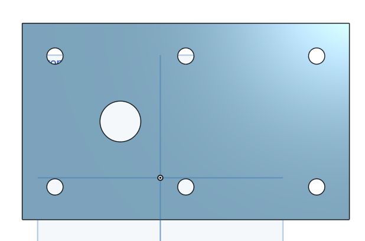
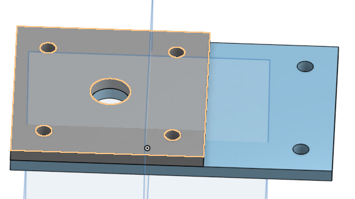
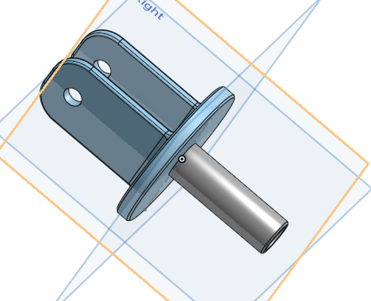
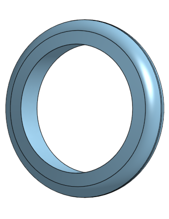
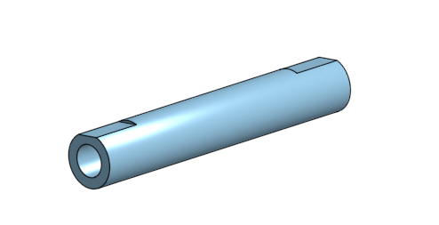

# BasicCAD

## Assignment

Making the base for the caster in OnShape

## Picture

## Reflection

I struggled with finding out how to use linear patterns but apart from that it went pretty smoothly.

## Onshape Document Link

https://cvilleschools.onshape.com/documents/621acf9e005317a0795c04d8/w/3e997265343d4f794759420c/e/0b0244c6c6dd0f0b5da51ff2

## Assignment

The assignment was to create a mount in OnShape for the caster

## Picture

## Reflection

The mount was pretty easy to do after I figured out the dimensions 

## https://cvilleschools.onshape.com/documents/621acf9e005317a0795c04d8/w/3e997265343d4f794759420c/e/0b0244c6c6dd0f0b5da51ff2

## Assignment

Making the fork for the caster in OnShape

## Picture

## Reflection

This video by Mr. Sheilds really helped me figure out each step and says all the dimensions - https://www.youtube.com/watch?time_continue=350&v=wQlTfOw8rYQ&feature=emb_title

## OnShape Document Link

https://cvilleschools.onshape.com/documents/621acf9e005317a0795c04d8/w/3e997265343d4f794759420c/e/8e08ff4192d3fd6323bb2c3b

## Assignment

Making the tire for the caster in OnShape

## Picture 

## Reflection

This video by Mr. Sheilds Helped me figure out how to make a angled dimension. - https://www.youtube.com/watch?time_continue=263&v=ReEGioIYSus&feature=emb_title

## OnShape Document Link

https://cvilleschools.onshape.com/documents/621acf9e005317a0795c04d8/w/3e997265343d4f794759420c/e/e823a4644a5a601187fcbe23

## Assignment

Making the axle for the caster in OnShape

## Picture

## Reflection

This video by Mr. Sheilds helped me make a extrude inwards - https://www.youtube.com/watch?v=2r7YqGuF1vY&t=11s

## OnShape Document Link

https://cvilleschools.onshape.com/documents/621acf9e005317a0795c04d8/w/3e997265343d4f794759420c/e/304cdd347d28049af4db4ec8
